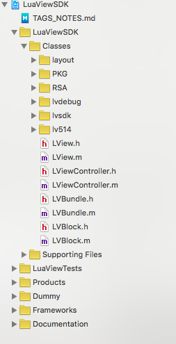

* 大家好，我叫LastDays，大三学生，目前在腾讯实习，这是我的[Blog](lastdays.cn)，我在这里分享我的学习，
* 我的[微博](http://weibo.com/p/1005055848341536/home?from=page_100505&mod=TAB&is_all=1#place)我在这里分享我的生活，欢迎交流
* 并且欢迎加入qq群554602551，这里我们一起交流分享

* 聚划算项目地址:[LuaViewSDK](https://github.com/alibaba/LuaViewSDK)
* 我的简单实现： [luaTest](https://github.com/MrLoong/luaTest)


# 利用Lua实现App动态化方案


因为动态化的东西我第一次看实现方案的源码，而且目前还是大三的学生，缺少很多实践经验说错的地方还请原谅，也希望能指出，被告知。想了很久还是决定写出来，求大神勿喷。


最近看到很多场对动态化提出了很多技术方案，原因就是客户端的业务需求越来越复杂，尤其是一些业务快速发展的互联网产品，肯定会造成版本的更新迭代跟不上业务的变化，尤其是App Store不确定性的审核，这个时候动态化的想法就自然的产生了。我不知道其他人是如何理解动态化的，但是我觉得，动态化指的就是我们不发布新的版本就可以实现大量的应用内容更新，这里的内容不应该仅仅是一些基本信息，应该涉及到应用的主题框架，甚至是布局，排版等。

因为我自己主要专注iOS，所以本次的源码分析和实现主要围绕iOS进行。


## App的设计方案

现在移动端有三种主流的设计方案，分别是Web App、Hybrid App、 Native App。简单的叙述下，这三种

* Web App：指的就是利用H5打造的应用，不需要下载，存活于浏览器中，类似轻应用。图像渲染由HTML，CSS完成,性能比较慢，个人感觉体验不是很好，模仿原生界面，大部分依赖于网络。
* Native App：指的就是原生程序，存活在操作系统中（iOS，Android）一个完整的App，但是需要客户下载安装使用。图像的渲染由本地API完成，采用原生组件，支持离线网络。
* Hybrid App：部分H5和部分Native的混合架构，这种方案以H5的动态性为基础，通过定义Native的扩展（Bridge）来实现动态化，大部分依赖于网络；
* Native View方案：使用Native进行渲染的Native View方案，通过修改预定结构中的数据，实现动态化
* ReactNative：通过JavaScript脚本引擎支持页面DOM转换和逻辑控制来实现动态化


## 动态对比

Hybrid App具备一定的动态能力，但是Hybrid的H5部分体验较差。Web App的体验跟网络有很大的关系，网络环境不好，体验会很差，而且H5的渲染能力比较差。Native View方案不支持逻辑代码的替换。ReactNative的JS引擎不够轻量，不适合大数量的ListView处理。甚至还有更多的动态划方案，尽管ReactNative很火，就像我一个朋友提到过的，到目前位置并没有一种方案统一了动态化方案。

## 发现LuaView

同样为了更加深入的了解动态化的实现，我尝试去分析一种方案的源码更加深入的去了解。这里我选择了阿里聚划算开源的LuaView，这里我并不了解聚划算的动态化方案是如何构建的，但是原因肯定是因为聚划算的业务不断的扩展，由于聚划算的业务变化需求，因此LuaView的实践性肯定是经过考验的，从实践的角度出发，我选择尝试分析它。


## 学习Lua的体会

我玩过愤怒的小鸟，用过Photoshop，但是我现在才知道Lua在它们两个中就有应用，接触后，发现Lua是一种轻量级的语言，它的官方版本只包括一个精简的核心和最基本的库，这就让它非常非常的小，编译后也仅仅就是百于k而已，这根Lua的设计目标有关系，它的目标就是成为一个很容易嵌入其它语言中使用的语言，而且Lua可以用于嵌入式硬件，不仅可以嵌入其他编程语言，而且可以嵌入微处理器中。

很多人会发现Lua很轻量，并不具备网络请求，图形UI等能力，但是很多应用使用Lua作为自己的嵌入式语言，因为他本身的接口易于扩展使得它可以通过宿主语言完成能力扩展

以上的Lua的这些特性就让我们发现，使用Lua构建动态化方案的核心就在于将Android，iOS原生的UI、网络、存储、硬件控制等能力桥接到Lua层。如果做到，这种方案就可以支持UI动态搭建、脚本、资源、逻辑动态下发。借助Lua语言的可扩展性，我们可以很方便地在Native跟Lua之间搭建起桥梁，将Native的各种能力迁移到Lua层。


## 分析LuaView

通过上面繁琐无聊的介绍，我们就可以来分析一波LuaView是如何将Android，iOS原生的UI、网络、存储、硬件控制等能力桥接到Lua层的。

LuaView的意图就是利用Lua去构建Native UI。LuaView没有去自己构建一个UI库，而是借用Android，iOS原生UI，Android支持的Lua引擎为LuaJ，iOS支持的Lua引擎为LuaC。

**根据聚划算团队的说明，
LuaView的一条重要设计原则就是同一份逻辑只写一份代码，这需要在设计SDK的时候尽可能得考虑到两个端的共性跟特性，将API构建在两个端的共性领域中，对于两端的特性领域则交由各自的Native部分来实现。**

为了实现这种能力，肯定需要构建一个桥接平台，并且设计好统一的API。

### 源码分析

源码看了很久，然后总算能总结出一些东西，因为还是学生，可能有些地方的实践跟我想的有差异，还希望大家提出。

在分析源码前不得不具体说说Lua，上面也提到过，这个Lua很轻量，很小。因此lua是一个嵌入式语言，就是说它不是一个单独的程序，而是一套可以在其它语言中使用的库，lua可以作为c语言的扩展，反过来也可以用c语言编写模块来扩展lua，这两种情况都使用同样的api进行交互。lua与c主要是通过一个虚拟的“栈”来交换数据。

这个虚拟“栈”是很关键的一个点，Lua利用一个虚拟的堆栈来给C传递值或从C获取值。每当Lua调用C函数，都会获得一个新的堆栈，该堆栈初始包含所有的调用C函数所需要的参数值（Lua传给C函数的调用实参），并且C函数执行完毕后，会把返回值压入这个栈（Lua从中拿到C函数调用结果）。

我自己就是理解Lua引擎在App中其实起到一个内置系统的能力，我们把Lua脚本注入应用程序，Lua引擎自己解析，运行，然后去调用原生UI，这就需要为我们的操作系统进行扩展，利用的就是lua可以作为c语言的扩展，反过来也可以用c语言编写模块来扩展lua

这些理论可能说起来很繁琐，也可能是我自己总结的不够清晰，我们现在来引入实践代码进行分析，最后我们在尝试自己去手动实现一些简单的动态化能力，这样会有更清晰的认知。

看一下LuaView的结构



lv514可以理解为Lua的源码，为什么说可以理解为？因为作者对Lua的源码进行了部分的更改，例如类名，还有一个函数名，举个典型的例子：

``` bash
struct lv_State {
  CommonHeader;
  lu_byte status;
  StkId top;  /* first free slot in the stack */
  StkId base;  /* base of current function */
  global_State *l_G;
  CallInfo *ci;  /* call info for current function */
  const Instruction *savedpc;  /* `savedpc' of current function */
  StkId stack_last;  /* last free slot in the stack */
  StkId stack;  /* stack base */
  CallInfo *end_ci;  /* points after end of ci array*/
  CallInfo *base_ci;  /* array of CallInfo's */
  int stacksize;
  int size_ci;  /* size of array `base_ci' */
  unsigned short nCcalls;  /* number of nested C calls */
  unsigned short baseCcalls;  /* nested C calls when resuming coroutine */
  lu_byte hookmask;
  lu_byte allowhook;
  int basehookcount;
  int hookcount;
  lv_Hook hook;
  TValue l_gt;  /* table of globals */
  TValue env;  /* temporary place for environments */
  GCObject *openupval;  /* list of open upvalues in this stack */
  GCObject *gclist;
  struct lv_longjmp *errorJmp;  /* current error recover point */
  ptrdiff_t errfunc;  /* current error handling function (stack index) */
    
    //
    void* lView;
};

```

这个状态机被进行了更改，并且加入的新元素

``` bash
void* lView;
```

对比下原来的

``` bash
struct lua_State {
  CommonHeader;
  lu_byte status;
  StkId top;  /* first free slot in the stack */
  StkId base;  /* base of current function */
  global_State *l_G;
  CallInfo *ci;  /* call info for current function */
  const Instruction *savedpc;  /* `savedpc' of current function */
  StkId stack_last;  /* last free slot in the stack */
  StkId stack;  /* stack base */
  CallInfo *end_ci;  /* points after end of ci array*/
  CallInfo *base_ci;  /* array of CallInfo's */
  int stacksize;
  int size_ci;  /* size of array `base_ci' */
  unsigned short nCcalls;  /* number of nested C calls */
  unsigned short baseCcalls;  /* nested C calls when resuming coroutine */
  lu_byte hookmask;
  lu_byte allowhook;
  int basehookcount;
  int hookcount;
  lua_Hook hook;
  TValue l_gt;  /* table of globals */
  TValue env;  /* temporary place for environments */
  GCObject *openupval;  /* list of open upvalues in this stack */
  GCObject *gclist;
  struct lua_longjmp *errorJmp;  /* current error recover point */
  ptrdiff_t errfunc;  /* current error handling function (stack index) */
};
```
**lvsdk**中存在就是很多扩展后的控件，通过编写Lua脚本可以直接调用的原生UI

具体为什么要更改我也不知道，如果你知道了，希望能私信告诉我，如果你想查看源码：看这里[Lua源码下载](http://www.lua.org/ftp/)


我刚刚编写了一个简单Lua脚本，并且进行下测试

```bash
button3 = Button();
button3.frame(150,250,100,100);
button3.image("button0.png","button1.png");


button3.callback(
    function()
        Alert("测试");
    end
);
```

``` bash
//
//  ViewController.m
//  luaTest
//
//  Created by LastDays on 16/6/7.
//  Copyright © 2016年 LastDays. All rights reserved.
//

#import "ViewController.h"
#import <LView.h>
@interface ViewController ()

@property(nonatomic,strong) LView *lview;

@end

@implementation ViewController

- (void)viewDidLoad {
    [super viewDidLoad];
    // Do any additional setup after loading the view, typically from a nib.
    CGRect cg = self.view.bounds;
    cg.origin = CGPointZero;
    self.lview = [[LView alloc] initWithFrame:cg];
    self.lview.viewController = self;
    [self.view addSubview:self.lview];
    [self.lview runFile:@"lastdays.lua"];
}

- (void)didReceiveMemoryWarning {
    [super didReceiveMemoryWarning];
    // Dispose of any resources that can be recreated.
}

@end

```

效果图：


可以看到调用的原生UI。


先来分析 

```  bash
self.lview = [[LView alloc] initWithFrame:cg];
```

在初始化中主要是执行两个方法，我主要挑这其中的主要代码说，就不全贴上来了，如果感兴趣可以下载源码看，其中一个是初始化用于加密解密的rsa以及对脚本资源文件进行管理的bundle

``` bash
-(void) myInit{
    self.rsa = [[LVRSA alloc] init];
    self.bundle = [[LVBundle alloc] init];
}
```

另一个就是：

``` bash
-(void) registeLibs{
    if( !self.stateInited ) {
        self.stateInited = YES;
        self.l =  lvL_newstate();//lv_open();  /* opens */
        lvL_openlibs(self.l);
        
        [LVRegisterManager registryApi:self.l lView:self];
        self.l->lView = (__bridge void *)(self);
    }
}
```

这里我们使用**lvL_newstate()**函数创建一个新的lua执行环境，但是这个函数中环境里什么都没有，因此需要使用**lvL_openlibs(self.l);**加载所有的标准库，之后可以使用。所有lua相关的东西都保存在lv_State这个结构中，通过**lvL_newstate()**创建一个新的 Lua 虚拟机时,第一块申请的内存将用来保存主线程和这个全局状态机。其实我个人感觉这就是一个内置在App中的运行环境，专门运行Lua脚本。

**[LVRegisterManager registryApi:self.l lView:self];**

这行代码，我就把它理解为扩展，对Lua API的一个扩展。上面我们提到过，使用Lua构建动态化方案的核心就在于将Android，iOS原生的UI、网络、存储、硬件控制等能力桥接到Lua层。他主要就是为了完成这里，在这里注册大量的API

看源码：

``` bash
// 注册函数
+(void) registryApi:(lv_State*)L  lView:(LView*)lView{
    //清理栈
    lv_settop(L, 0);
    lv_checkstack(L, 128);
    
    // 注册静态全局方法和常量
    [LVRegisterManager registryStaticMethod:L lView:lView];
    
    // 注册System对象
    [LVSystem classDefine:L];
    
    // 基础数据结构data
    [LVData classDefine:L];
    [LVStruct classDefine:L];
    
    // 注册UI类
    lv_settop(L, 0);
    [LVBaseView classDefine:L];
    [LVButton    classDefine:L ];
    [LVImage classDefine:L];
    [LVLabel     classDefine:L ];
    [LVScrollView classDefine:L];
    [LVTableView classDefine:L];
    [LVCollectionView classDefine:L];
    [LVPagerView classDefine:L];
    [LVTimer       classDefine:L];
    [LVPagerIndicator classDefine:L];
    [LVCustomPanel classDefine:L];
    [LVTransform3D classDefine:L];
    [LVAnimator classDefine:L];
    [LVTextField classDefine:L];
    [LVAnimate classDefine:L];
    [LVDate classDefine:L];
    [LVAlert classDefine:L];
    // 注册DB
    [LVDB classDefine:L];
    
    //清理栈
    lv_settop(L, 0);
    
    // 注册手势
    [LVGestureRecognizer    classDefine:L];
    [LVTapGestureRecognizer classDefine:L];
    [LVPinchGestureRecognizer classDefine:L];
    [LVRotationGestureRecognizer classDefine:L];
    [LVSwipeGestureRecognizer classDefine:L];
    [LVLongPressGestureRecognizer classDefine:L];
    [LVPanGestureRecognizer classDefine:L];
    
    //清理栈
    lv_settop(L, 0);
    [LVLoadingIndicator classDefine:L];
    
    // http
    [LVHttp classDefine:L];
    
    // 文件下载
    [LVDownloader classDefine:L];
    
    // 文件
    [LVFile classDefine:L];
    
    
    // 声音播放
    [LVAudioPlayer classDefine:L];
    
    // 调试
    [LVDebuger classDefine:L];
    
    // attributedString
    [LVStyledString classDefine:L];
    
    // 注册 系统对象window
    [LVRegisterManager registryWindow:L lView:lView];
    
    // 导航栏按钮
    [LVNavigation classDefine:L];
    
    //清理栈
    lv_settop(L, 0);
    
    //外链注册器
    [LVExternalLinker classDefine:L];
    
    //清理栈
    lv_settop(L, 0);
    return;
}
```

简单介绍下这两个函数的作用**lv_settop(L, 0)**,**lv_checkstack(L, 128)**,**lv_settop(L, 0)**设置栈顶索引，即设置栈中元素的个数，如果index<0，则从栈顶往下数,**lv_checkstack(L, 128)**确保堆栈上至少有 extra 个空位.按照上面注释的解释就是为了做清理栈的工作。

因为这里注册了太多的API，主要是为了弄清原理，那么我们就选择我们脚本中使用的Button来分析。也就是这行代码

``` bash
[LVButton    classDefine:L ];
```

LVButton继承自UIButton并且遵循LVProtocal协议。看一下classDefine:方法

``` bash
+(int) classDefine:(lv_State *)L {
    {
        lv_pushcfunction(L, lvNewButton);
        lv_setglobal(L, "Button");
    }
    const struct lvL_reg memberFunctions [] = {
        {"image",    image},
        
        {"font",    font},
        {"fontSize",    fontSize},
        {"textSize",    fontSize},
        
        {"titleColor",    titleColor},
        {"title",    title},
        {"textColor",    titleColor},
        {"text",    title},

        {"selected",    selected},
        {"enabled",    enabled},
        
        //{"showsTouchWhenHighlighted",    showsTouchWhenHighlighted},
        {NULL, NULL}
    };
    
    lv_createClassMetaTable(L,META_TABLE_UIButton);
    
    lvL_openlib(L, NULL, [LVBaseView baseMemberFunctions], 0);
    lvL_openlib(L, NULL, memberFunctions, 0);
    
    const char* keys[] = { "addView", NULL};// 移除多余API
    lv_luaTableRemoveKeys(L, keys );
    
    return 1;
}
```

其中这段代码：

``` bash
lv_pushcfunction(L, lvNewButton);
lv_setglobal(L, "Button");
```

**lvNewButton**是一个函数，我们上面说过，我们跟Lua环境的交互主要是通过一个虚拟的栈，**lv_pushcfunction(L, lvNewButton)**的作用就是将lvNewButton函数压入栈顶，然后使用**lv_setglobal(L, "Button")**将栈顶的lvNewButton函数传入Lua环境中作为全局函数。这样就是扩展我们的Lua环境，现在我们就可以编写Lua脚本，通过Button()关键字来调用**lvNewButton**函数。


``` bash
const struct lvL_reg memberFunctions [] = {
        {"image",    image},
        
        {"font",    font},
        {"fontSize",    fontSize},
        {"textSize",    fontSize},
        
        {"titleColor",    titleColor},
        {"title",    title},
        {"textColor",    titleColor},
        {"text",    title},

        {"selected",    selected},
        {"enabled",    enabled},
        
        //{"showsTouchWhenHighlighted",    showsTouchWhenHighlighted},
        {NULL, NULL}
    };
```

来看下lvL_Reg的结构体

``` bash
typedef struct lvL_Reg {
  const char *name;
  lv_CFunction func;
} lvL_Reg;
```

看到该结构体也可以看出，包含name，和func。name就是为了，在注册时用于通知Lua该函数的名字。结构体数组中的最后一个元素的两个字段均为NULL，用于提示Lua注册函数已经到达数组的末尾。

这里我们其实可以理解为为Button添加库，像image，font这些在源码中可以看到，是一些静态的c函数

例如：

``` bash
static int image (lv_State *L) {
    LVUserDataInfo * user = (LVUserDataInfo *)lv_touserdata(L, 1);
    if( user ){
        NSString* normalImage = lv_paramString(L, 2);// 2
        NSString* hightLightImage = lv_paramString(L, 3);// 2
        //NSString* disableImage = lv_paramString(L, 4);// 2
        //NSString* selectedImage = lv_paramString(L, 5);// 2
        LVButton* button = (__bridge LVButton *)(user->object);
        if( [button isKindOfClass:[LVButton class]] ){
            [button setImageUrl:normalImage placeholder:nil state:UIControlStateNormal];
            [button setImageUrl:hightLightImage placeholder:nil state:UIControlStateHighlighted];
            //[button setImageUrl:disableImage placeholder:nil state:UIControlStateDisabled];
            //[button setImageUrl:selectedImage placeholder:nil state:UIControlStateSelected];
            
            lv_pushvalue(L, 1);
            return 1;
        }
    }
    return 0;
}
```

现在可以重新看一下我们原来写的Lua脚本了

``` bash
button = Button();
button.frame(150,250,100,100);
button.image("button0.png","button1.png");


button.callback(
    function()
        Alert("LatDays");
    end
);
```

可以看到我么你的Button，还有image就是我们上面添加的标识。感兴趣可以下载demo做一些更改。就会发现两者是对应的。

我个人理解原因就是像Lua源码解析中说的，global_State 里面有对主线程的引用,有注册表管理所有全局数据,有全局字符串表,有内存管理函数, 有 GC 需要的把所有对象串联起来的相关信息,以及一切 Lua 在工作时需要的工作内存。

UI的扩展我们看完了，现在来分析下Lua脚本文件是如何运行的。

``` bash
- (void)viewDidLoad {
    [super viewDidLoad];
    // Do any additional setup after loading the view, typically from a nib.
    CGRect cg = self.view.bounds;
    cg.origin = CGPointZero;
    self.lview = [[LView alloc] initWithFrame:cg];
    self.lview.viewController = self;
    [self.view addSubview:self.lview];
    [self.lview runFile:@"lastdays.lua"];
}
```

这段代码中我们可以看到**[self.lview runFile:@"lastdays.lua"]**做的Lua脚本文件的加载。接着放下看就可以发现我们利用前面介绍的bundle来读取脚本文件中的代码，并且存储为NSData类型。

``` bash
NSData* code = [self.bundle scriptWithName:fileName];
```

接着往下查看，就会看到这个函数:


``` bash
-(NSString*) runData:(NSData *)data fileName:(NSString*)fileName{
    if( self.l==NULL ){
        LVError( @"Lua State is released !!!");
        return @"Lua State is released !!!";
    }
    if( fileName==nil ){
        static int i = 0;
        fileName = [NSString stringWithFormat:@"%d.lua",i];
    }
    if( data.length<=0 ){
        LVError(@"running chars == NULL, file: %@",fileName);
        return [NSString stringWithFormat:@"running chars == NULL, file: %@",fileName];
    }
#ifdef DEBUG
    [self checkDeuggerIsRunningToLoadDebugModel];
    [self checkDebugOrNot:data.bytes length:data.length fileName:fileName];
#endif
    
    int error = -1;
    error = lvL_loadbuffer(self.l, data.bytes , data.length, fileName.UTF8String) ;
    if ( error ) {
        const char* s = lv_tostring(self.l, -1);
        LVError( @"%s", s );
#ifdef DEBUG
        NSString* string = [NSString stringWithFormat:@"[LuaView][error]   %s\n",s];
        lv_printToServer(self.l, string.UTF8String, 0);
#endif
        return [NSString stringWithFormat:@"%s",s];
    } else {
        return lv_runFunction(self.l);
    }
}
```


这个函数中

``` bash
lvL_loadbuffer(self.l, data.bytes , data.length, fileName.UTF8String) ;
```
lua相关的东西都保存在lv_State这个结构中，lvL_loadbuffer加载lua代码，加载之后就是运行，又是谁完成的运行呢？

我猜测是**lv_runFunction(self.l)**，然后就顺着找下去，看到以下源码：

``` bash
NSString* lv_runFunctionWithArgs(lv_State* l, int nargs, int nret){
    if( l && lv_type(l, -1) == LV_TFUNCTION ) {
        if( nargs>0 ){
            lv_insert(l, -nargs-1);
        }
        int errorCode = lv_pcall( l, nargs, nret, 0);
        if ( errorCode != 0 ) {
            const char* s = lv_tostring(l, -1);
            LVError( @"%s", s );
#ifdef DEBUG
            NSString* string = [NSString stringWithFormat:@"[LuaView][error]   %s",s];
            lv_printToServer(l, string.UTF8String, 0);
#endif
            return [NSString stringWithFormat:@"%s",s];
        }
        return nil;
    }
    return @"function is nil error";
}
```

这段代码中我找到了这个函数：

``` bash
int errorCode = lv_pcall( l, nargs, nret, 0);
```
它的意思就是在lua保护模式下运行语句。如果运行出错，函数会把错误信息压到“栈”里。我们可以通过

``` bash
char* s = lv_tostring(l, -1);
```

来获取错误信息。在调用函数前，用户应该先把语句所需的参数都压到栈里，参数nargs说明有多少个参数，nresults表示返回值有多少个。如果msgh值为0表示“栈”里返回的是原始的错误信息。在函数执行完后，lua会把函数以及其使用的参数从栈里删掉，并且把结果压入栈里。lua函数并不会打印任何信息，它只会返回一个错误代码，然后由调用者对错误进行适当的处理。

可以看到

``` bash
lv_printToServer(l, string.UTF8String, 0);
```
这段代码就是将输出信息在控制台输出，具体的实现就不描述了。


### 源码分析总结

LuaViewSDK 可以通过 Lua 脚本桥接所有 Native 的功能，所以具有与 Native 一样丰富的性能。以上这些就是我自己总结的LuaView调用原生UI的过程，我们如何扩展Lua，并且我们又是如何加载Lua脚本，并且调用Native UI。

当然，LuaViewSDK当中还包含着包的管理和下载，还有更新的一些方案，我还没有仔细看，看了以后还会总结分享。

这里看在聚划算团队分享的LuaView SDK整体架构


如图，以下为聚划算团队说明LuaView SDK的整体架构可以表示为五层。

自下而上第一、二层依次是OS层和Framework层，分别表示了Android、iOS以及对应的框架层。

紧接着是Lua虚拟机，在Android、iOS平台分别是LuaJ和LuaC，两个虚拟机都是目前两个语言中用的最广泛，最稳定的虚拟机。

处在第三层的还有脚本管理模块以及安全控制模块，它们分别负责Lua本地脚本管理（包括脚本的解包、验证、加解密、解压缩等工作）和Lua脚本的安全校验工作（脚本完整性校验以及脚本安全校验等）。

处在第四层的是LuaView的核心Lib库，包括两部分，一部分是Lua UI Lib，主要是所有的UI组件（如Button、Label、Image、TableView等）；一部分是Lua Non-UI Lib，主要是所有非UI组件（如Http、Json、Audio等）。

处在最上层的是Lua业务脚本代码以及Lua层的Lib库（方便第三方使用的Lua写的Lib库）。

**还有很多细节的地方，和经典的设计，因为能力和实践经验有限，没有发现，如果有更多的认知，希望告诉我，接下来就是自己尝试做桥接。**


## 使用Lua实现动态化


首先还是引入我们LuaC的引擎，就引用LuaViewSDK的LuaC吧

我们就自己实现一个Lable吧，其实实现也是在模仿LuaViewSDK进行实现，主要还是为了验证上面的分析

首先创建我们的LDSView来承载我们的Lable

``` bash
//生成库
-(void)generateLibs{
    self.lvState = lvL_newstate();
    lvL_openlibs(self.lvState);
    
    [RegisterManager registerApiWithlvState:self.lvState];
    self.lvState->lView = (__bridge void *)(self);
    
}
```

首先就是创建我们的Lua脚本运行环境，并且以上语句的具体作用上面都有过讲解，**self.lvState->lView**这里主要是因为我们所需的运行东西都在lv_State结构体中，我们就在这个结构体中添加了一指针，来指向我们的当前LDSView。这样就在状态机中存在着lView了。

``` bash
-(NSString *)runScriptWithScriptName:(NSString *)scriptName{
    NSData *code = [self.bundle scriptWithName:scriptName];
    
    
    NSString *result = [[NSString alloc] initWithData:code  encoding:NSUTF8StringEncoding];
    NSLog(@"%@",result);
    
    
    
    return[self runData:code fileName:scriptName];
}

```

这里就是copy了LuaViewSDK资源文件的管理代码，主要就是为了进行代码的读取，并且将本地脚本代码读取出来的代码传入下面的函数来运行

``` bash
-(NSString*) runData:(NSData *)data fileName:(NSString*)fileName{
    

    lvL_loadbuffer(self.lvState, data.bytes , data.length, fileName.UTF8String) ;
    return lds_runFunctionWithArgs(self.lvState, 0, 0);
    
}
```

可以看到运行的话就是利用lvL_loadbuffer来加载代码，然后就是调用**lds_runFunctionWithArgs**这个c函数来运行脚本代码。

``` bash
NSString* lds_runFunctionWithArgs(lv_State* l, int nargs, int nret){
    lv_pcall( l, nargs, nret, 0);
    return nil;

}
```
这里的实现的关键就是**lv_pcall**，调用它，让Lua脚本在Lua运行环境中以安全的方式进行运行。


上面这些就是代码的加载和运行。


然后就是将UILabel桥接到Lua层，实现扩展，来让我们能够使用Lua脚本去调用原生的UI。

``` bash
#import "RegisterManager.h"

@implementation RegisterManager

+(void)registerApiWithlvState:(lv_State*)lvState{
    [LDSLable classDefine:lvState];
    
}

@end
```

也就是这里，我们在这里进行注册，具体看一下**classDefine:**的实现

``` bash
+(void)classDefine:(lv_State *)lvState{
    lv_pushcfunction(lvState, ldsNewLabel);
    lv_setglobal(lvState, "Label");
}

```

我们上面提到过，Lua跟C的交互主要是通过一个虚拟的栈来实现的，**lv_pushcfunction**将函数ldsNewLabel压入栈中，然后利用lv_setglobal将栈顶的lvNewButton函数传入Lua环境中作为全局函数，并且实现让我们能够在Lua脚本中利用Label关键字调用ldsNewLabel函数。

我们来看下ldsNewLabel函数

``` bash
static int ldsNewLabel(lv_State *lvState){
    NSString* text = @"成功调用";
    LDSLable* label = [[LDSLable alloc] init:text lv_State:lvState];
    LDSView* view = (__bridge LDSView *)(lvState->lView);
    [view addSubview:label];
    
    NSLog(@"进入label的创建");
    
    return 1;
}
```

这就是一个简单的c函数。其中

``` bash
    LDSLable* label = [[LDSLable alloc] init:text lv_State:lvState];
```

就是来生成UILabel控件的。我们的LDSLable其实是继承自UILabel的，看到以下代码，大家就能够明白了。

``` bash
-(id) init:(NSString*)text lv_State:(lv_State*) lvState{
    self = [super init];
    if( self ){
        self.text = text;
        self.backgroundColor = [UIColor blueColor];
        self.textAlignment = NSTextAlignmentLeft;
        self.clipsToBounds = YES;
        self.font = [UIFont systemFontOfSize:14];
        self.frame = CGRectMake(30, 30, 200, 200);
    }
    return self;
}
```

在这里我们完成了很多基本属性的设置。

另一段代码

``` bash
LDSView* view = (__bridge LDSView *)(lvState->lView);
[view addSubview:label];
```
还记得我们在lv_State状态机中添加了什么吗？对，就是在这里用到了，让我们状态机中的LDSView添加了label控件。


现在看一下Lua的脚本文件**lastdays.lua**


``` bash
label = Label();
```

就这么一句话，就可以生成一个原生UILabel。

看一下我们的调用

``` bash

- (void)viewDidLoad {
    [super viewDidLoad];
    [self LDSView];
}

-(void)LDSView{
    CGRect cg = self.view.bounds;
    cg.origin = CGPointZero;
    self.ldsView = [[LDSView alloc] initWithFrame:cg];
    [self.view addSubview:self.ldsView];
    [self.ldsView runScriptWithScriptName:@"lastdays.lua"];
}
```

来看下效果：


我没有编写其他控制属性的函数，直接就在init全部搞定了，就是简单的实现下证明下上面的思路，结果看来还是正确。如果你也感兴趣欢迎去文章的上面查看两个代码的源码。


## 总结

我个人感觉LuaView在聚划算中得到大量的使用，并且这么长时间，运行状态也很稳定说明LuaView还是有很多我值得学习的地方，上面的分析感觉也就是LuaView的一些皮毛，还有很多关键的点，和设计模式没有分析出来，并且Lua和C的交互扩展主要是依靠那个虚拟的"栈"，这里的原理我还没有看的太明白，后面还会大量的学习。并且还希望多交流，因为现在才大三，缺少很多实践经验，有很多地方理解的可能是错误的，希望能被指出，勿喷勿喷。

我叫LastDays，一个90后iOS开发者。


